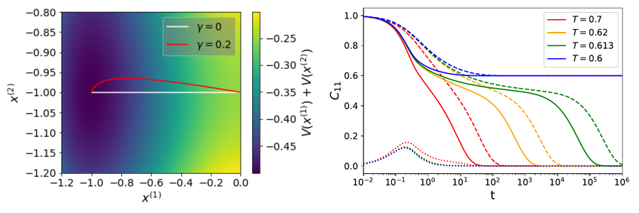
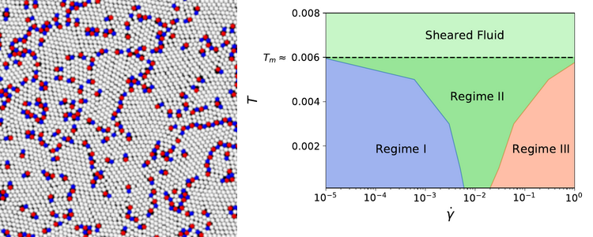

some text aligned to the right of the image

 

 Hello! I am Federico Ghimenti. I am a Physics phD student at Université de Paris, working under the supervision of Frederic Van Wijland. I am interested in the structural glass transition, which I investigate using both analytical and numerical techniques.

# Research Projects
## Accelerate dynamics dynamics of glasses with irreversible samplers
Simulations of glasses and supercooled liquids are challenging due to the impressive slowdown of their dynamics at low temperatures. In recent years, many alternative dynamical evolution rules have been designed to accelerate the dynamics. My phD advisor Frederic Van Wijland and I have considered a specific irreversible dynamics that samples a targeted Boltzmann distribution, quantifying the gain in convergence time obtained by such a dynamics for a system with one energy barrier and for a mean field disordered model with many local minima.   

Bibliography: F. Ghimenti, F. Van Wijland, _Accelerating, to some extent, the p-spin dynamics_, Submitted to Physical Review E (2022)   

## Plastic flow of two-dimensional solids
Everyday intuition tells us that liquids flow, while solids do not. However, when a crystalline solid at finite temperature is subjected to any arbitrary small shear stress, nucleation of defects called dislocations occurs after some time. These defects travel through the solid relaxing the stress, thus allowing the sample to flow at a finite rate. In collaboration with Giulio Biroli, Misaki Ozawa and Gilles Tarjus, I have investigated the microscopic properties of such a plastic flow through simulations of a two dimensional crystal. In addition to the plastic behavior, we have witnessed and characterized other exotic phase transitions as the shear rate increased.

Bibliography: F. Ghimenti, G. Biroli, M. Ozawa, G. Tarjus, _Plastic flow of two-dimensional solids_, in preparation

# Contacts
Université de Paris

10 rue Alice Domon et Léonie Duquet

75205 Paris cedex 13

Bureau 768A

Tel: +33(0)620659334

Mail: federico.ghimenti AT etu.u-paris DOT fr
