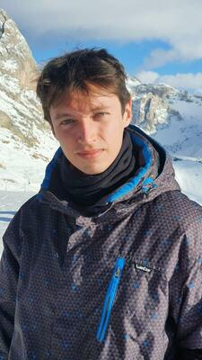

  <a href="https://federicoghimenti.github.io">Home</a> |
  <a href="https://federicoghimenti.github.io/cv">CV</a> |
  <a href="https://federicoghimenti.github.io/research">Research</a> |
  <a href="https://federicoghimenti.github.io/contacts">Contacts</a>

{: style="float:left; padding-right:30px" }
I am a postdoctoral fellow int the department of Applied Physics at Stanford. I am interested in the theory of machine learning and neural networks.

I obtained my PhD in Physics at Université Paris Cité, working under the supervision of Frédéric Van Wijland. In my thesis, I addressed how and to what extent certain types of nonequilibrium dynamics can be used to enhance sampling in glasses and amorphous materials. 
 

<head>
  <title>federicoghimenti.github.io</title>
  <meta name="google-site-verification" content="googleaf73a127a1ada9c8.html" />
</head>
