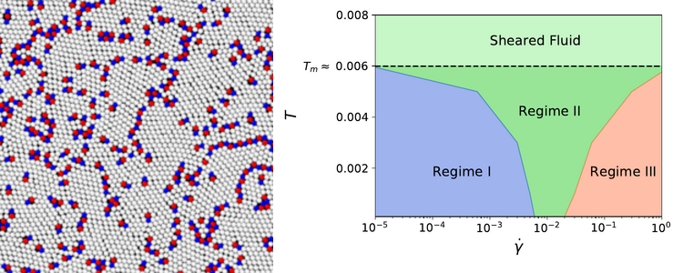

  <a href="https://federicoghimenti.github.io">Home</a> |
  <a href="https://federicoghimenti.github.io/cv">CV</a> |
  <a href="https://federicoghimenti.github.io/research">Research</a> |
  <a href="https://federicoghimenti.github.io/contacts">Contacts</a>

## Accelerate dynamics of glasses with irreversible samplers
Simulations of glasses and supercooled liquids are challenging due to the impressive slowdown of their dynamics at low temperatures. In recent years, many alternative dynamical evolution rules have been designed to accelerate the dynamics. My phD advisor Frederic Van Wijland and I have considered a specific irreversible dynamics that samples a targeted Boltzmann distribution, which is known to exhibit a qualitative acceleration in the relaxation toward the steady state. We quantified this speedup for a system with one energy barrier and for a mean field disordered model with many local minima, providing a physical interpretation of the acceleration in terms of an increased mobility and of the phase space trajectories of the dynamics.   

**Bibliography**: F. Ghimenti, F. Van Wijland, _Accelerating, to some extent, the p-spin dynamics_, Submitted to Physical Review E (2022)   

## Plastic flow of two-dimensional solids
Everyday intuition tells us that liquids flow, while solids do not. However, when a crystalline solid is subjected to shear stress, nucleation of defects called dislocations occurs after some time. These defects travel through the solid relaxing the stress, allowing the sample to flow at a finite rate even in the presence of an infinitesimal shear stress. This fundamental phenomenon is not yet well understood. In collaboration with Giulio Biroli, Misaki Ozawa and Gilles Tarjus, I have investigated the microscopic properties of this plastic flow through simulations of a two dimensional crystal. In addition to the plastic behavior, we have witnessed and characterized other exotic phase transitions as the shear rate increased.

**Bibliography**: F. Ghimenti, G. Biroli, M. Ozawa, G. Tarjus, _Plastic flow of two-dimensional solids_, in preparation

 
