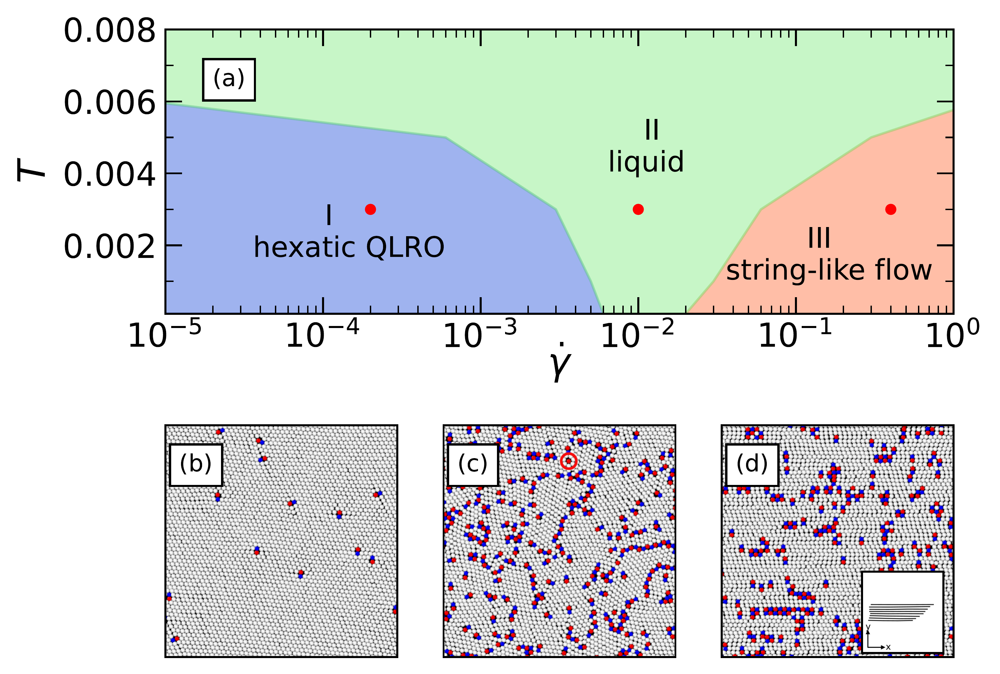

  <a href="https://federicoghimenti.github.io">Home</a> |
  <a href="https://federicoghimenti.github.io/cv">CV</a> |
  <a href="https://federicoghimenti.github.io/research">Research</a> |
  <a href="https://federicoghimenti.github.io/contacts">Contacts</a>

[Link to google scholar](https://scholar.google.com/scholar?hl=en&as_sdt=0%2C5&q=federico+ghimenti&oq=feder)
## [Transverse forces and glassy liquids in infinite dimensions](https://arxiv.org/abs/2402.10856)

## [A speedup of 40 in hard disks glasses](https://arxiv.org/abs/2402.06585)

## [Sampling efficiency of transverse forces in dense liquids](https://journals.aps.org/prl/abstract/10.1103/PhysRevLett.131.257101)

## Accelerating the dynamics of glasses with irreversible samplers
Simulations of glasses and supercooled liquids are challenging due to the impressive slowdown of their dynamics at low temperatures, which requires extremely long simulation times before being able to sample the Boltzmann distribution. Simulations can be accelerated by proposing unphysical moves that nevertheless sample the correct target distribution. Among these technique, one possibility consist in injecting in the system a supplementary current, driving it out of equilibrum. I am interested in how big is the speedup yield by these kind of dynamics in glassy systems. Look <a href="https://federicoghimenti.github.io/Transverse_Poster.pdf">here</a> for a poster on on a mean field spin glass and <a href="https://federicoghimenti.github.io/pspin_poster.pdf">here</a> for the case of structural glasses.

**Bibliography**: [F. Ghimenti, F. Van Wijland, _Accelerating, to some extent, the p-spin dynamics_](https://journals.aps.org/pre/abstract/10.1103/PhysRevE.105.054137#), Physical Review E, 2022

## Plastic flow of two-dimensional solids
Everyday intuition tells us that liquids flow, while solids do not. However, when a crystalline solid is subjected to shear stress, nucleation of defects called dislocations occurs after some time. These defects travel through the solid relaxing the stress, allowing the sample to flow at a finite rate even in the presence of an infinitesimal shear stress. This fundamental phenomenon is not yet well understood. In collaboration with Giulio Biroli, Misaki Ozawa and Gilles Tarjus, I have investigated the microscopic properties of plastic flow through simulations of a two dimensional crystal. In addition to the plastic behavior, we have witnessed and characterized other exotic phase transitions as the shear rate increased.

**Bibliography**: [F. Ghimenti, G. Biroli, M. Ozawa, G. Tarjus, _Shear-Induced Phase Behavior and Topological Defects in Two-Dimensional Crystals_](https://arxiv.org/abs/2310.05094) submitted to Phys. Rev. B

 
