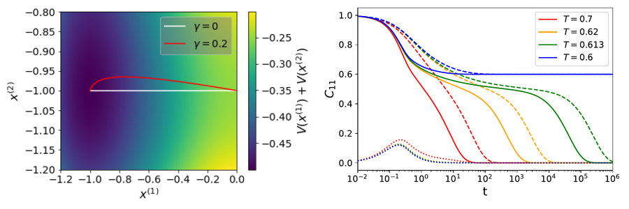

  <a href="https://federicoghimenti.github.io">Home</a> |
  <a href="https://federicoghimenti.github.io/cv">CV</a> |
  <a href="https://federicoghimenti.github.io/research">Research</a> |
  <a href="https://federicoghimenti.github.io/contacts">Contacts</a>

[Link to google scholar](https://scholar.google.com/scholar?hl=en&as_sdt=0%2C5&q=federico+ghimenti&oq=feder)
## [Transverse forces and glassy liquids in infinite dimensions](https://arxiv.org/abs/2402.10856)

## [A speedup of 40 in hard disks glasses](https://arxiv.org/abs/2402.06585)

## [Sampling efficiency of transverse forces in dense liquids](https://journals.aps.org/prl/abstract/10.1103/PhysRevLett.131.257101)

## [Accelerating, to some extent, the p spin dynamics](https://journals.aps.org/pre/abstract/10.1103/PhysRevE.105.054137#)

## [Plastic flow of two-dimensional solids](https://arxiv.org/abs/2310.05094)

 
